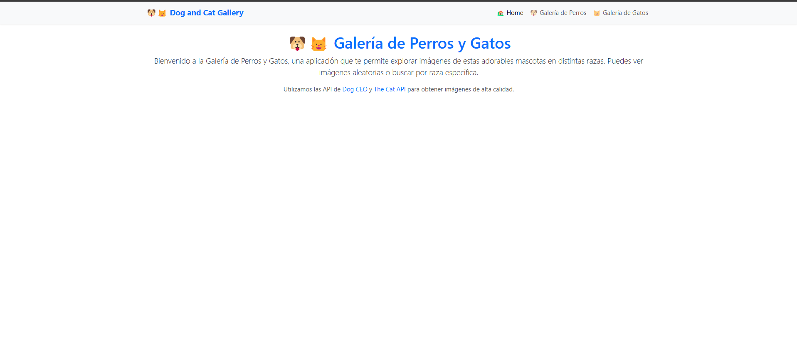
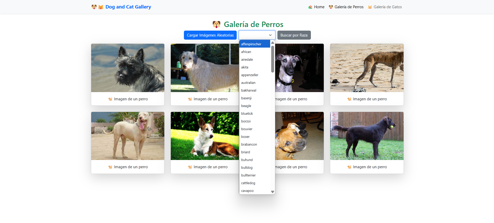
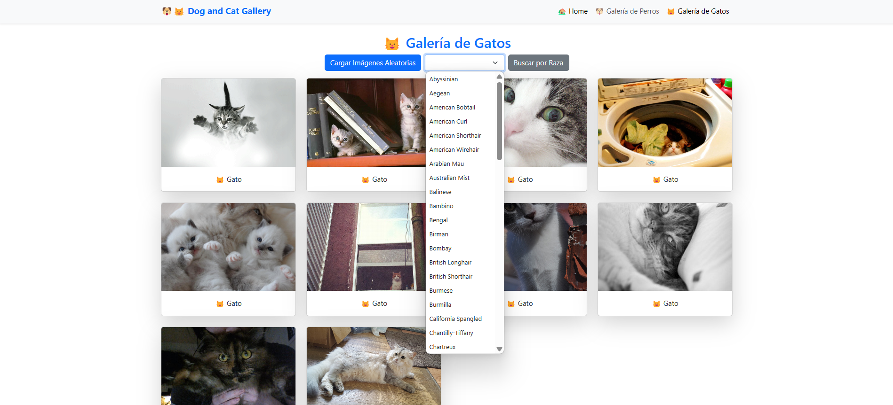

# 🐶🐱 Dog and Cat Gallery  

Aplicación web en Angular que muestra imágenes de perros y gatos utilizando las APIs de **Dog CEO** y **The Cat API**. Permite visualizar imágenes aleatorias y buscar por raza.  

## 🚀 Características  
✅ Galería de imágenes de perros y gatos.  
✅ Búsqueda de imágenes por raza.  
✅ Diseño responsivo con **Bootstrap**.  
✅ Carga diferida (**Lazy Loading**) para mejor rendimiento.  
✅ Código modular y bien estructurado.  

## 📂 Estructura del Proyecto  
El proyecto está organizado de la siguiente manera:  

## 📸 Capturas de Pantalla

### 🏠 Página de Inicio  

### 🐶 Galería de Perros  

### 🐱 Galería de Gatos  

